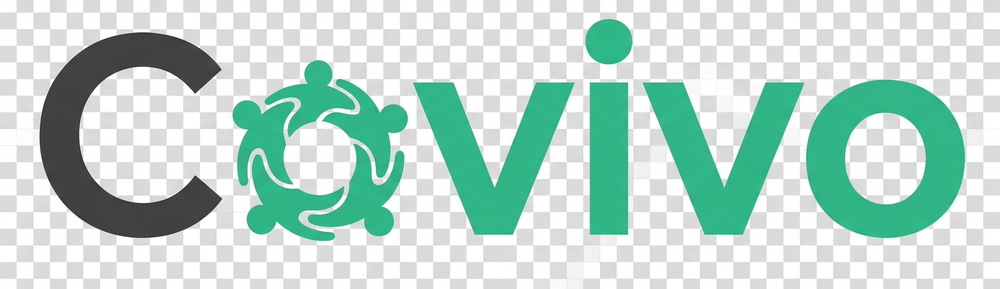

# Co-Vivo

*A plataforma definitiva para gestão financeira e de convivência em moradias compartilhadas.*

---

Co-Vivo é um sistema de gestão 360º para vida compartilhada, projetado para eliminar o caos financeiro e organizacional de repúblicas, apartamentos divididos e qualquer lar com múltiplos moradores. A plataforma vai além de simples divisores de contas, oferecendo um ecossistema flexível que se adapta à forma como cada casa realmente funciona, trazendo transparência, justiça e simplicidade para o dia a dia.

## ✨ Principais Funcionalidades (As "Riquezas" do Produto)

O Co-Vivo é construído sobre uma arquitetura robusta que permite funcionalidades únicas e poderosas.

### 1. Gestão Financeira Flexível (Modelo P2P)

O coração do Co-Vivo é um sistema de ledger "Pessoa-para-Pessoa" (P2P).

- **Rastreamento Real:** Em vez de uma dívida genérica "com a casa", o sistema rastreia exatamente **quem deve para quem**, refletindo a realidade de um ambiente com múltiplos pagadores.
- **Balanço Líquido:** Calcula automaticamente o saldo líquido entre cada par de membros (ex: se você deve R$50 para o João e ele te deve R$20, o sistema mostra que sua dívida final com ele é de R$30).
- **Painel Pessoal Claro:** Cada usuário tem uma visão clara de suas finanças com duas listas simples: "Para Quem Você Deve" e "Quem Te Deve".

### 2. Múltiplos Modelos de Gestão

O Co-Vivo entende que cada casa funciona de um jeito. Por isso, o grupo pode escolher seu modo de operação:

- **Tesoureiro Central:** Ideal para grupos com uma conta central ou um único "tesoureiro". A interface é simplificada para mostrar um saldo único "com a casa", mas a lógica P2P continua por baixo dos panos.
- **Responsabilidades Compartilhadas:** Perfeito para a maioria das casas, onde qualquer um pode pagar as contas. A interface mostra a matriz P2P completa, e cada membro pode confirmar os pagamentos que recebe diretamente.

### 3. Controle de "Contas a Pagar"

O sistema diferencia contas que já foram pagas de contas que apenas chegaram e estão aguardando pagamento.

- **Lançamento de Contas a Vencer:** Permite que um admin lance uma despesa (ex: conta de luz do mês) sem que ninguém ainda a tenha pago. A despesa fica visível para todos como uma "responsabilidade futura".
- **Assumir Pagamento:** Quando um membro paga essa conta, ele pode "reivindicar" o pagamento no app com um clique. A partir desse momento, a conta se torna uma dívida P2P ativa, e o pagador se torna o credor.

### 4. Simplificação de Dívidas

Uma funcionalidade inteligente que reduz o número de transferências bancárias necessárias para acertar as contas do grupo.

- **Algoritmo de Otimização:** O sistema analisa o gráfico completo de dívidas P2P e calcula o caminho mais curto para quitar tudo. (ex: se A deve para B, e B deve para C, ele sugere que A pague diretamente para C).
- **Interface Clara:** Apresenta um plano de pagamentos otimizado e fácil de seguir para todos os membros.

### 5. Gestão de Despesas Completa

- **Lançamento Detalhado:** Permite adicionar categoria, descrição, data e anexar a foto do recibo/nota fiscal a cada despesa.
- **Despesas Recorrentes:** Automação para contas fixas como aluguel, internet e assinaturas.
- **Controle de Parcelamentos:** Lançamento de compras parceladas com o sistema se encarregando de criar as cobranças futuras automaticamente.

### 6. Painel de Auditoria do Administrador

Uma visão "onisciente" para o gestor do grupo, garantindo total controle e transparência.

- **Matriz de Dívidas Completa:** Visualização de todo o balanço P2P do grupo.
- **Auditoria por Membro:** Capacidade de fazer um "drill-down" em qualquer membro e ver um extrato detalhado de todas as dívidas e créditos que compõem seu saldo.

### 7. Ferramentas de Convivência

- **Mural de Avisos:** Para comunicados importantes.
- **Regras da Casa:** Um local central para documentar as regras de convivência.
- **Enquetes:** Sistema de votação para decisões em grupo.
- **Listas de Compras:** Listas compartilhadas e sincronizadas em tempo real.
- **Inventário:** Para controlar itens de propriedade comum do grupo.

## 🛠️ Tecnologias Utilizadas

- **Frontend**: React 18 com Vite e TypeScript
- **Estilização**: Tailwind CSS, shadcn/ui (Radix UI) e Framer Motion/Recharts
- **Roteamento**: React Router Dom v6
- **Gerenciamento de Estado & Dados**: TanStack Query v5 (React Query)
- **Backend & Autenticação**: Supabase (PostgreSQL com RLS, Storage, Edge Functions)
- **Formulários e Validação**: React Hook Form com Zod

## 🚀 Como Executar o Projeto

1.  **Clone o repositório.**
2.  **Instale as dependências:** `npm install`
3.  **Configure suas variáveis de ambiente** em um arquivo `.env` na raiz do projeto, apontando para seu projeto Supabase.
4.  **Inicie o servidor de desenvolvimento:** `npm run dev`
